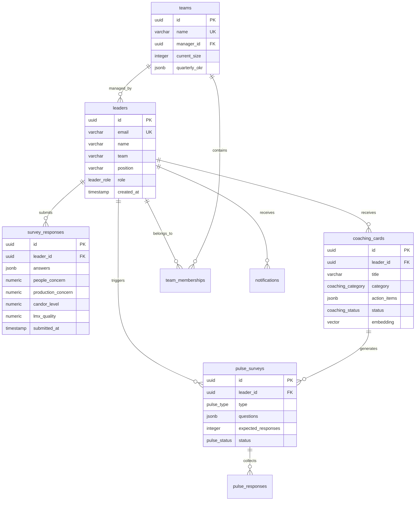

# Grid 3.0 리더십 매핑 플랫폼 데이터베이스 스키마

> 최종 업데이트: 2025-08-02  
> 작성자: 헤파이스토스  
> DB 버전: PostgreSQL 15 with pgvector  
> 스키마 버전: v1.0

## 목차

1. [데이터베이스 개요](#1-데이터베이스-개요)
2. [핵심 테이블](#2-핵심-테이블)
3. [관계 다이어그램](#3-관계-다이어그램)
4. [인덱스 전략](#4-인덱스-전략)
5. [데이터 타입 및 제약조건](#5-데이터-타입-및-제약조건)
6. [샘플 데이터](#6-샘플-데이터)
7. [마이그레이션 스크립트](#7-마이그레이션-스크립트)
8. [성능 최적화](#8-성능-최적화)

## 1. 데이터베이스 개요

### 1.1 설계 원칙

- **정규화**: 3NF까지 정규화하되 성능을 위해 선택적 비정규화
- **확장성**: 수평 확장을 고려한 파티셔닝 전략
- **성능**: 자주 사용되는 쿼리 패턴에 최적화된 인덱스
- **유연성**: JSONB를 활용한 스키마리스 데이터 저장
- **벡터 검색**: pgvector를 활용한 AI 코칭 추천

### 1.2 데이터베이스 구성

```sql
-- 필수 확장 설치
CREATE EXTENSION IF NOT EXISTS "uuid-ossp";
CREATE EXTENSION IF NOT EXISTS "pgcrypto";
CREATE EXTENSION IF NOT EXISTS "vector";

-- 스키마 생성
CREATE SCHEMA IF NOT EXISTS grid3;
SET search_path TO grid3, public;
```

## 2. 핵심 테이블

### 2.1 leaders (리더 기본정보)

```sql
CREATE TABLE leaders (
    id UUID PRIMARY KEY DEFAULT uuid_generate_v4(),
    email VARCHAR(255) UNIQUE NOT NULL,
    name VARCHAR(100) NOT NULL,
    team VARCHAR(100),
    position VARCHAR(100),
    department VARCHAR(100),
    hire_date DATE,
    manager_id UUID REFERENCES leaders(id),
    
    -- 인증 관련
    password_hash VARCHAR(255),
    last_login_at TIMESTAMP WITH TIME ZONE,
    is_active BOOLEAN DEFAULT true,
    role leader_role DEFAULT 'leader',
    
    -- 메타데이터
    created_at TIMESTAMP WITH TIME ZONE DEFAULT NOW(),
    updated_at TIMESTAMP WITH TIME ZONE DEFAULT NOW(),
    
    -- 제약조건
    CONSTRAINT valid_email CHECK (email ~* '^[A-Za-z0-9._%+-]+@[A-Za-z0-9.-]+\.[A-Z|a-z]{2,}$'),
    CONSTRAINT name_not_empty CHECK (LENGTH(TRIM(name)) > 0)
);

-- 권한 레벨 enum
CREATE TYPE leader_role AS ENUM ('admin', 'manager', 'leader');
```

### 2.2 survey_responses (설문 응답)

```sql
CREATE TABLE survey_responses (
    id UUID PRIMARY KEY DEFAULT uuid_generate_v4(),
    leader_id UUID NOT NULL REFERENCES leaders(id) ON DELETE CASCADE,
    
    -- 원본 응답 데이터
    answers JSONB NOT NULL,
    response_metadata JSONB,
    
    -- 계산된 4D 점수
    people_concern NUMERIC(4,3) NOT NULL CHECK (people_concern >= 1 AND people_concern <= 9),
    production_concern NUMERIC(4,3) NOT NULL CHECK (production_concern >= 1 AND production_concern <= 9),
    candor_level NUMERIC(4,3) NOT NULL CHECK (candor_level >= 1 AND candor_level <= 9),
    lmx_quality NUMERIC(4,3) NOT NULL CHECK (lmx_quality >= 1 AND lmx_quality <= 9),
    
    -- 파생 지표
    leadership_style VARCHAR(50),
    balance_score NUMERIC(4,3),
    risk_score NUMERIC(4,3),
    
    -- 품질 지표
    completion_time_seconds INTEGER,
    response_consistency NUMERIC(3,2),
    
    -- 타임스탬프
    submitted_at TIMESTAMP WITH TIME ZONE DEFAULT NOW(),
    processed_at TIMESTAMP WITH TIME ZONE DEFAULT NOW(),
    
    -- 인덱스를 위한 생성일 (월별 파티셔닝용)
    created_month DATE GENERATED ALWAYS AS (DATE_TRUNC('month', submitted_at)) STORED
);

-- 응답 데이터 구조 검증
ALTER TABLE survey_responses ADD CONSTRAINT valid_answers_structure 
CHECK (
    jsonb_typeof(answers) = 'array' AND 
    jsonb_array_length(answers) = 31
);
```

### 2.3 coaching_cards (코칭 카드)

```sql
CREATE TABLE coaching_cards (
    id UUID PRIMARY KEY DEFAULT uuid_generate_v4(),
    leader_id UUID NOT NULL REFERENCES leaders(id) ON DELETE CASCADE,
    
    -- 카드 기본정보
    title VARCHAR(200) NOT NULL,
    category coaching_category NOT NULL,
    priority coaching_priority DEFAULT 'medium',
    description TEXT,
    
    -- 액션 아이템들
    action_items JSONB NOT NULL DEFAULT '[]',
    resources JSONB NOT NULL DEFAULT '[]',
    success_metrics JSONB NOT NULL DEFAULT '[]',
    
    -- 상태 관리
    status coaching_status DEFAULT 'active',
    assigned_at TIMESTAMP WITH TIME ZONE DEFAULT NOW(),
    due_date TIMESTAMP WITH TIME ZONE,
    completed_at TIMESTAMP WITH TIME ZONE,
    
    -- 완료 평가
    completion_notes TEXT,
    effectiveness_rating INTEGER CHECK (effectiveness_rating >= 1 AND effectiveness_rating <= 5),
    would_recommend BOOLEAN,
    
    -- AI 추천 관련
    recommendation_reason TEXT,
    generated_by VARCHAR(50) DEFAULT 'ai_engine',
    confidence_score NUMERIC(3,2),
    
    -- 벡터 검색용 (pgvector)
    embedding vector(384), -- sentence-transformers 기본 차원
    
    -- 메타데이터
    created_at TIMESTAMP WITH TIME ZONE DEFAULT NOW(),
    updated_at TIMESTAMP WITH TIME ZONE DEFAULT NOW()
);

-- 코칭 카테고리 enum
CREATE TYPE coaching_category AS ENUM (
    'people_concern',
    'production_concern', 
    'candor',
    'lmx',
    'leadership_style',
    'team_dynamics',
    'communication',
    'decision_making'
);

-- 우선순위 enum
CREATE TYPE coaching_priority AS ENUM ('low', 'medium', 'high', 'urgent');

-- 상태 enum
CREATE TYPE coaching_status AS ENUM ('active', 'pending', 'completed', 'skipped', 'expired');
```

### 2.4 pulse_surveys (Quick Pulse 설문)

```sql
CREATE TABLE pulse_surveys (
    id UUID PRIMARY KEY DEFAULT uuid_generate_v4(),
    leader_id UUID NOT NULL REFERENCES leaders(id) ON DELETE CASCADE,
    coaching_card_id UUID REFERENCES coaching_cards(id),
    
    -- 설문 기본정보
    pulse_type pulse_type NOT NULL,
    questions JSONB NOT NULL,
    target_respondents JSONB NOT NULL, -- 팀원 이메일 리스트
    
    -- 발송 정보
    sent_at TIMESTAMP WITH TIME ZONE DEFAULT NOW(),
    deadline TIMESTAMP WITH TIME ZONE NOT NULL,
    google_form_url VARCHAR(500),
    
    -- 응답 현황
    expected_responses INTEGER NOT NULL,
    actual_responses INTEGER DEFAULT 0,
    response_rate NUMERIC(5,2) GENERATED ALWAYS AS (
        CASE WHEN expected_responses > 0 
             THEN (actual_responses::NUMERIC / expected_responses * 100)
             ELSE 0 END
    ) STORED,
    
    -- 상태
    status pulse_status DEFAULT 'sent',
    
    -- 메타데이터
    created_at TIMESTAMP WITH TIME ZONE DEFAULT NOW(),
    completed_at TIMESTAMP WITH TIME ZONE
);

-- Pulse 타입 enum
CREATE TYPE pulse_type AS ENUM ('candor_lmx', 'team_effectiveness', 'leadership_impact');

-- Pulse 상태 enum  
CREATE TYPE pulse_status AS ENUM ('draft', 'sent', 'completed', 'expired');
```

### 2.5 pulse_responses (Pulse 응답)

```sql
CREATE TABLE pulse_responses (
    id UUID PRIMARY KEY DEFAULT uuid_generate_v4(),
    pulse_survey_id UUID NOT NULL REFERENCES pulse_surveys(id) ON DELETE CASCADE,
    
    -- 응답자 정보 (익명화)
    respondent_hash VARCHAR(64) NOT NULL, -- SHA-256 해시
    team_member_role VARCHAR(100),
    
    -- 응답 데이터
    answers JSONB NOT NULL,
    additional_comments TEXT,
    
    -- 메타데이터
    submitted_at TIMESTAMP WITH TIME ZONE DEFAULT NOW(),
    ip_address INET, -- 중복 응답 방지용
    
    -- 중복 방지 제약
    UNIQUE(pulse_survey_id, respondent_hash)
);
```

### 2.6 teams (팀 정보)

```sql
CREATE TABLE teams (
    id UUID PRIMARY KEY DEFAULT uuid_generate_v4(),
    name VARCHAR(100) UNIQUE NOT NULL,
    department VARCHAR(100),
    manager_id UUID REFERENCES leaders(id),
    
    -- 팀 메트릭
    target_size INTEGER,
    current_size INTEGER,
    
    -- OKR 관련
    quarterly_okr JSONB,
    okr_achievement_rate NUMERIC(5,2),
    
    -- 메타데이터
    created_at TIMESTAMP WITH TIME ZONE DEFAULT NOW(),
    updated_at TIMESTAMP WITH TIME ZONE DEFAULT NOW(),
    
    CONSTRAINT positive_team_size CHECK (target_size > 0 AND current_size >= 0)
);

-- 리더-팀 관계 테이블
CREATE TABLE team_memberships (
    id UUID PRIMARY KEY DEFAULT uuid_generate_v4(),
    leader_id UUID NOT NULL REFERENCES leaders(id) ON DELETE CASCADE,
    team_id UUID NOT NULL REFERENCES teams(id) ON DELETE CASCADE,
    role VARCHAR(50) DEFAULT 'member',
    joined_at TIMESTAMP WITH TIME ZONE DEFAULT NOW(),
    left_at TIMESTAMP WITH TIME ZONE,
    
    UNIQUE(leader_id, team_id, joined_at),
    
    -- 현재 소속 여부 체크
    CONSTRAINT valid_membership_period CHECK (left_at IS NULL OR left_at > joined_at)
);
```

### 2.7 notifications (알림 로그)

```sql
CREATE TABLE notifications (
    id UUID PRIMARY KEY DEFAULT uuid_generate_v4(),
    recipient_id UUID REFERENCES leaders(id),
    
    -- 알림 내용
    type notification_type NOT NULL,
    title VARCHAR(200) NOT NULL,
    content TEXT,
    
    -- 채널별 정보
    email_sent BOOLEAN DEFAULT false,
    slack_sent BOOLEAN DEFAULT false,
    in_app_read BOOLEAN DEFAULT false,
    
    -- 메타데이터
    created_at TIMESTAMP WITH TIME ZONE DEFAULT NOW(),
    sent_at TIMESTAMP WITH TIME ZONE,
    read_at TIMESTAMP WITH TIME ZONE,
    
    -- 관련 엔티티
    related_entity_type VARCHAR(50),
    related_entity_id UUID
);

-- 알림 타입 enum
CREATE TYPE notification_type AS ENUM (
    'survey_reminder',
    'coaching_card_assigned',
    'pulse_survey_sent',
    'achievement_unlocked',
    'system_announcement'
);
```

### 2.8 audit_logs (감사 로그)

```sql
CREATE TABLE audit_logs (
    id UUID PRIMARY KEY DEFAULT uuid_generate_v4(),
    user_id UUID REFERENCES leaders(id),
    
    -- 액션 정보
    action VARCHAR(100) NOT NULL,
    resource_type VARCHAR(100) NOT NULL,
    resource_id UUID,
    
    -- 변경 내용
    old_values JSONB,
    new_values JSONB,
    
    -- 컨텍스트
    ip_address INET,
    user_agent TEXT,
    
    -- 타임스탬프
    created_at TIMESTAMP WITH TIME ZONE DEFAULT NOW()
);
```

## 3. 관계 다이어그램



## 4. 인덱스 전략

### 4.1 기본 인덱스

```sql
-- leaders 테이블
CREATE INDEX idx_leaders_email ON leaders(email);
CREATE INDEX idx_leaders_team ON leaders(team);
CREATE INDEX idx_leaders_active ON leaders(is_active) WHERE is_active = true;
CREATE INDEX idx_leaders_manager ON leaders(manager_id) WHERE manager_id IS NOT NULL;

-- survey_responses 테이블
CREATE INDEX idx_survey_responses_leader_time ON survey_responses(leader_id, submitted_at DESC);
CREATE INDEX idx_survey_responses_month ON survey_responses(created_month);
CREATE INDEX idx_survey_responses_scores ON survey_responses(people_concern, production_concern, candor_level, lmx_quality);

-- coaching_cards 테이블
CREATE INDEX idx_coaching_cards_leader_status ON coaching_cards(leader_id, status);
CREATE INDEX idx_coaching_cards_category ON coaching_cards(category);
CREATE INDEX idx_coaching_cards_priority ON coaching_cards(priority) WHERE status = 'active';

-- pulse_surveys 테이블
CREATE INDEX idx_pulse_surveys_leader ON pulse_surveys(leader_id);
CREATE INDEX idx_pulse_surveys_deadline ON pulse_surveys(deadline) WHERE status IN ('sent');

-- 성능 최적화 인덱스
CREATE INDEX idx_notifications_unread ON notifications(recipient_id, created_at DESC) 
WHERE in_app_read = false;
```

### 4.2 벡터 검색 인덱스

```sql
-- pgvector HNSW 인덱스 (코칭 카드 유사도 검색용)
CREATE INDEX idx_coaching_cards_embedding ON coaching_cards 
USING hnsw (embedding vector_cosine_ops) 
WITH (m = 16, ef_construction = 64);
```

### 4.3 복합 인덱스

```sql
-- 대시보드 성능 최적화
CREATE INDEX idx_dashboard_metrics ON survey_responses(leader_id, submitted_at DESC) 
INCLUDE (people_concern, production_concern, candor_level, lmx_quality);

-- 팀별 분석 쿼리 최적화
CREATE INDEX idx_team_analysis ON leaders(team) 
INCLUDE (id, name, position) WHERE is_active = true;
```

## 5. 데이터 타입 및 제약조건

### 5.1 데이터 검증 함수

```sql
-- 설문 응답 유효성 검증
CREATE OR REPLACE FUNCTION validate_survey_answers(answers JSONB)
RETURNS BOOLEAN AS $$
BEGIN
    -- 31개 문항 체크
    IF jsonb_array_length(answers) != 31 THEN
        RETURN FALSE;
    END IF;
    
    -- 각 응답이 1-7 범위인지 체크
    FOR i IN 0..30 LOOP
        IF (answers->>i)::INTEGER < 1 OR (answers->>i)::INTEGER > 7 THEN
            RETURN FALSE;
        END IF;
    END LOOP;
    
    RETURN TRUE;
END;
$$ LANGUAGE plpgsql;

-- 4D 점수 계산 함수
CREATE OR REPLACE FUNCTION calculate_4d_scores(answers JSONB)
RETURNS TABLE(
    people_concern NUMERIC(4,3),
    production_concern NUMERIC(4,3),
    candor_level NUMERIC(4,3),
    lmx_quality NUMERIC(4,3)
) AS $$
BEGIN
    RETURN QUERY SELECT
        -- People Concern (문항 1-8)
        (SELECT AVG((answers->>i)::INTEGER) FROM generate_series(0,7) i)::NUMERIC(4,3),
        -- Production Concern (문항 9-16) 
        (SELECT AVG((answers->>i)::INTEGER) FROM generate_series(8,15) i)::NUMERIC(4,3),
        -- Candor Level (문항 17-24)
        (SELECT AVG((answers->>i)::INTEGER) FROM generate_series(16,23) i)::NUMERIC(4,3),
        -- LMX Quality (문항 25-31)
        (SELECT AVG((answers->>i)::INTEGER) FROM generate_series(24,30) i)::NUMERIC(4,3);
END;
$$ LANGUAGE plpgsql;
```

### 5.2 트리거 함수

```sql
-- 자동 타임스탬프 업데이트
CREATE OR REPLACE FUNCTION update_updated_at_column()
RETURNS TRIGGER AS $$
BEGIN
    NEW.updated_at = NOW();
    RETURN NEW;
END;
$$ LANGUAGE plpgsql;

-- 설문 응답 시 4D 점수 자동 계산
CREATE OR REPLACE FUNCTION auto_calculate_scores()
RETURNS TRIGGER AS $$
DECLARE
    scores RECORD;
BEGIN
    -- 4D 점수 계산
    SELECT * INTO scores FROM calculate_4d_scores(NEW.answers);
    
    NEW.people_concern := scores.people_concern;
    NEW.production_concern := scores.production_concern;  
    NEW.candor_level := scores.candor_level;
    NEW.lmx_quality := scores.lmx_quality;
    
    -- 리더십 스타일 결정
    NEW.leadership_style := determine_leadership_style(
        scores.people_concern, 
        scores.production_concern
    );
    
    RETURN NEW;
END;
$$ LANGUAGE plpgsql;

-- 트리거 생성
CREATE TRIGGER tr_update_timestamp 
    BEFORE UPDATE ON leaders
    FOR EACH ROW EXECUTE FUNCTION update_updated_at_column();

CREATE TRIGGER tr_auto_calculate_scores
    BEFORE INSERT ON survey_responses
    FOR EACH ROW EXECUTE FUNCTION auto_calculate_scores();
```

## 6. 샘플 데이터

### 6.1 초기 데이터 삽입

```sql
-- 샘플 리더 데이터
INSERT INTO leaders (id, email, name, team, position, role) VALUES
    ('550e8400-e29b-41d4-a716-446655440000', 'kim.leader@company.com', '김리더', 'engineering', 'Tech Lead', 'leader'),
    ('660e8400-e29b-41d4-a716-446655440001', 'park.manager@company.com', '박매니저', 'product', 'Product Manager', 'manager'),
    ('770e8400-e29b-41d4-a716-446655440002', 'admin@company.com', '시스템관리자', 'it', 'System Admin', 'admin');

-- 샘플 팀 데이터
INSERT INTO teams (id, name, department, manager_id, target_size, current_size) VALUES
    ('880e8400-e29b-41d4-a716-446655440003', 'engineering', 'Technology', '550e8400-e29b-41d4-a716-446655440000', 15, 12),
    ('990e8400-e29b-41d4-a716-446655440004', 'product', 'Product', '660e8400-e29b-41d4-a716-446655440001', 8, 6);

-- 샘플 설문 응답
INSERT INTO survey_responses (
    leader_id, 
    answers,
    people_concern,
    production_concern, 
    candor_level,
    lmx_quality,
    leadership_style,
    completion_time_seconds
) VALUES (
    '550e8400-e29b-41d4-a716-446655440000',
    '[7,6,8,5,9,4,7,6,8,7,9,5,6,8,7,9,8,6,7,5,9,8,6,7,5,8,6,7,9,5,8]',
    7.125,
    7.375,
    6.75,
    7.0,
    '팀형(7.1, 7.4)',
    485
);
```

### 6.2 테스트 데이터 생성 함수

```sql
-- 랜덤 설문 응답 생성
CREATE OR REPLACE FUNCTION generate_random_survey_response(p_leader_id UUID)
RETURNS UUID AS $$
DECLARE
    random_answers JSONB;
    response_id UUID;
BEGIN
    -- 1-7 범위의 랜덤 답변 31개 생성
    SELECT jsonb_agg(floor(random() * 7 + 1)::int)
    INTO random_answers
    FROM generate_series(1, 31);
    
    INSERT INTO survey_responses (leader_id, answers)
    VALUES (p_leader_id, random_answers)
    RETURNING id INTO response_id;
    
    RETURN response_id;
END;
$$ LANGUAGE plpgsql;
```

## 7. 마이그레이션 스크립트

### 7.1 초기 스키마 생성

```sql
-- migrations/001_initial_schema.sql
BEGIN;

-- 확장 설치
CREATE EXTENSION IF NOT EXISTS "uuid-ossp";
CREATE EXTENSION IF NOT EXISTS "pgcrypto";
CREATE EXTENSION IF NOT EXISTS "vector";

-- 스키마 생성
CREATE SCHEMA IF NOT EXISTS grid3;
SET search_path TO grid3, public;

-- Enum 타입들 생성
CREATE TYPE leader_role AS ENUM ('admin', 'manager', 'leader');
CREATE TYPE coaching_category AS ENUM (
    'people_concern', 'production_concern', 'candor', 'lmx',
    'leadership_style', 'team_dynamics', 'communication', 'decision_making'
);
CREATE TYPE coaching_priority AS ENUM ('low', 'medium', 'high', 'urgent');
CREATE TYPE coaching_status AS ENUM ('active', 'pending', 'completed', 'skipped', 'expired');
CREATE TYPE pulse_type AS ENUM ('candor_lmx', 'team_effectiveness', 'leadership_impact');
CREATE TYPE pulse_status AS ENUM ('draft', 'sent', 'completed', 'expired');
CREATE TYPE notification_type AS ENUM (
    'survey_reminder', 'coaching_card_assigned', 'pulse_survey_sent',
    'achievement_unlocked', 'system_announcement'
);

-- 테이블 생성 (위의 CREATE TABLE 문들)
-- ... (모든 테이블 DDL)

-- 인덱스 생성
-- ... (모든 인덱스 DDL)

-- 함수 및 트리거 생성
-- ... (모든 함수 및 트리거 DDL)

COMMIT;
```

### 7.2 데이터 마이그레이션

```sql
-- migrations/002_seed_data.sql
BEGIN;

SET search_path TO grid3, public;

-- 초기 관리자 계정 생성
INSERT INTO leaders (email, name, role, password_hash) VALUES
('admin@grid3.com', 'Grid3 Administrator', 'admin', crypt('admin123', gen_salt('bf')));

-- 기본 팀 생성
INSERT INTO teams (name, department) VALUES
('Leadership Team', 'Management'),
('Engineering', 'Technology'),
('Product', 'Product'),
('Design', 'Creative');

COMMIT;
```

## 8. 성능 최적화

### 8.1 쿼리 최적화

```sql
-- 대시보드 성능 최적화 뷰
CREATE MATERIALIZED VIEW mv_dashboard_summary AS
SELECT 
    l.team,
    COUNT(*) as leader_count,
    AVG(sr.people_concern) as avg_people_concern,
    AVG(sr.production_concern) as avg_production_concern,
    AVG(sr.candor_level) as avg_candor_level,
    AVG(sr.lmx_quality) as avg_lmx_quality,
    COUNT(DISTINCT sr.id) as survey_count,
    MAX(sr.submitted_at) as last_survey_date
FROM leaders l
LEFT JOIN LATERAL (
    SELECT * FROM survey_responses sr2 
    WHERE sr2.leader_id = l.id 
    ORDER BY submitted_at DESC 
    LIMIT 1
) sr ON true
WHERE l.is_active = true
GROUP BY l.team;

-- 인덱스 생성
CREATE UNIQUE INDEX idx_mv_dashboard_summary_team ON mv_dashboard_summary(team);

-- 자동 갱신 함수
CREATE OR REPLACE FUNCTION refresh_dashboard_summary()
RETURNS VOID AS $$
BEGIN
    REFRESH MATERIALIZED VIEW CONCURRENTLY mv_dashboard_summary;
END;
$$ LANGUAGE plpgsql;
```

### 8.2 파티셔닝

```sql
-- 설문 응답 월별 파티셔닝 (향후 대용량 데이터 대비)
-- ALTER TABLE survey_responses_old RENAME TO survey_responses_old;

CREATE TABLE survey_responses_partitioned (
    LIKE survey_responses INCLUDING ALL
) PARTITION BY RANGE (created_month);

-- 월별 파티션 생성 함수
CREATE OR REPLACE FUNCTION create_monthly_partition(target_month DATE)
RETURNS VOID AS $$
DECLARE
    partition_name TEXT;
    start_date DATE;
    end_date DATE;
BEGIN
    partition_name := 'survey_responses_' || to_char(target_month, 'YYYY_MM');
    start_date := date_trunc('month', target_month);
    end_date := start_date + interval '1 month';
    
    EXECUTE format('
        CREATE TABLE IF NOT EXISTS %I PARTITION OF survey_responses_partitioned
        FOR VALUES FROM (%L) TO (%L)',
        partition_name, start_date, end_date
    );
END;
$$ LANGUAGE plpgsql;
```

### 8.3 벡터 검색 최적화

```sql
-- 코칭 카드 유사도 검색 함수
CREATE OR REPLACE FUNCTION find_similar_coaching_cards(
    target_embedding vector(384),
    leader_id_param UUID,
    limit_count INTEGER DEFAULT 5
)
RETURNS TABLE(
    card_id UUID,
    title VARCHAR(200),
    similarity NUMERIC(5,4)
) AS $$
BEGIN
    RETURN QUERY
    SELECT 
        cc.id,
        cc.title,
        1 - (cc.embedding <=> target_embedding) as similarity
    FROM coaching_cards cc
    WHERE cc.leader_id != leader_id_param
        AND cc.status = 'completed'
        AND cc.effectiveness_rating >= 4
    ORDER BY cc.embedding <=> target_embedding
    LIMIT limit_count;
END;
$$ LANGUAGE plpgsql;
```

### 8.4 성능 모니터링

```sql
-- 느린 쿼리 모니터링 뷰
CREATE VIEW slow_queries AS
SELECT 
    query,
    calls,
    total_time,
    mean_time,
    rows,
    100.0 * shared_blks_hit / nullif(shared_blks_hit + shared_blks_read, 0) AS hit_percent
FROM pg_stat_statements
WHERE mean_time > 100  -- 100ms 이상
ORDER BY mean_time DESC;

-- 테이블 크기 모니터링
CREATE VIEW table_sizes AS
SELECT 
    schemaname,
    tablename,
    pg_size_pretty(pg_total_relation_size(schemaname||'.'||tablename)) as size,
    pg_total_relation_size(schemaname||'.'||tablename) as size_bytes
FROM pg_tables 
WHERE schemaname = 'grid3'
ORDER BY size_bytes DESC;
```

---

## 백업 및 복구 전략

### 백업 스크립트

```bash
#!/bin/bash
# backup_grid3.sh

DB_NAME="grid3_production"
BACKUP_DIR="/backups/grid3"
DATE=$(date +%Y%m%d_%H%M%S)

# 전체 DB 백업
pg_dump -h localhost -U postgres -d $DB_NAME \
    --format=custom \
    --compress=9 \
    --file="$BACKUP_DIR/grid3_full_$DATE.dump"

# 스키마만 백업
pg_dump -h localhost -U postgres -d $DB_NAME \
    --schema-only \
    --file="$BACKUP_DIR/grid3_schema_$DATE.sql"

# 7일 이상 된 백업 파일 삭제
find $BACKUP_DIR -name "*.dump" -mtime +7 -delete
```

### 복구 스크립트

```bash
#!/bin/bash
# restore_grid3.sh

BACKUP_FILE=$1
DB_NAME="grid3_production"

if [ -z "$BACKUP_FILE" ]; then
    echo "Usage: $0 <backup_file>"
    exit 1
fi

# 데이터베이스 재생성
dropdb -h localhost -U postgres $DB_NAME
createdb -h localhost -U postgres $DB_NAME

# 백업에서 복구
pg_restore -h localhost -U postgres -d $DB_NAME \
    --verbose \
    --clean \
    --if-exists \
    $BACKUP_FILE
```

이 데이터베이스 스키마는 Grid 3.0 리더십 매핑 플랫폼의 모든 데이터 요구사항을 충족하며, 확장성과 성능을 고려하여 설계되었습니다.