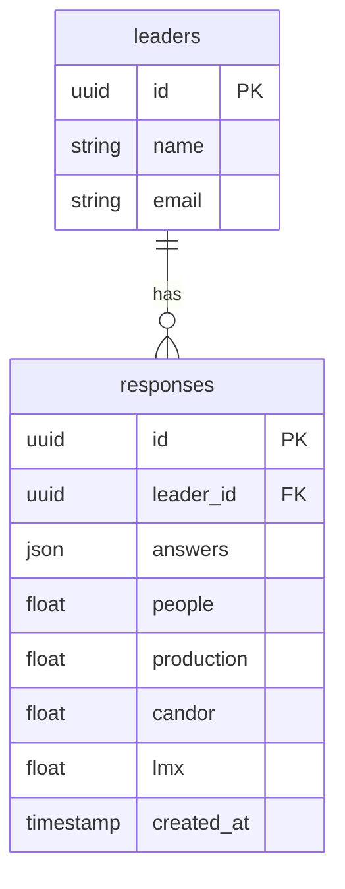

## 제품 요구 사항 문서 (PRD)

**제품명** : **Grid 3.0 리더십 매핑 플랫폼**
**개발 환경** : Claude Code (Python 3.10 + FastAPI + PostgreSQL)

---

### 1. 목적 / Vision

빠르게 성장하는 스타트업이 리더십 갭을 실시간으로 파악·코칭할 수 있도록,

* **Managerial Grid(사람·성과)**,
* **Radical Candor(관심·직면)**,
* **LMX(리더–구성원 관계 질)**
  세 축을 **단일 대시보드**에 통합해 보여 주고, 행동 개선 과제를 제안한다.

---

### 2. 핵심 지표(KPIs)

| 지표            | 목표치    | 측정 주기               |
| ------------- | ------ | ------------------- |
| 리더 설문 완료율     | ≥ 95 % | 분기                  |
| 4D 이동거리 평균\*  | +2 p↑  | 분기 \*(사람·성과·직면·LMX) |
| 팀 OKR 달성률     | +10 %↑ | 분기                  |
| 리더 번아웃 위험 스코어 | −15 %↓ | 분기                  |

---

### 3. 사용자 시나리오

1. **People Ops**가 Google Form 링크 발송 → 리더 20명이 10분 내 자가 진단을 완료.
2. API Webhook이 응답 값을 DB에 저장하고 4D 좌표 계산.
3. 대시보드에 각 리더 점·벡터가 3D WebGL로 실시간 렌더링.
4. 리더가 그래프에서 자신의 점을 클릭 → **AI 코칭 카드**(3개 행동 과제 + 참고 자료 링크) 표시.
5. 코칭 과제 완료 후 체크하면 Candor·LMX Quick Pulse(3문항)가 자동 발송.

---

### 4. 기능 요구 사항

#### 4.1 설문 처리

| ID    | 기능    | 상세                                             |
| ----- | ----- | ---------------------------------------------- |
| FR-01 | 설문 수집 | Google Form CSV Webhook → `/ingest` API (JSON) |
| FR-02 | 응답 검증 | 값 1-7 범위 확인, 누락 시 0 처리                         |
| FR-03 | 점수 계산 | XY(사람·성과) = 평균, Z(직면) = 직면 평균, LMX = 평균→size   |

#### 4.2 데이터베이스



#### 4.3 대시보드 / API

| ID     | Endpoint         | 설명                                | Method |
| ------ | ---------------- | --------------------------------- | ------ |
| API-01 | `/leader/{id}`   | 리더 4D 좌표·벡터 반환                    | GET    |
| API-02 | `/coaching/{id}` | 개인화 코칭 카드 (3 개)                   | GET    |
| API-03 | `/pulse/send`    | Candor·LMX Quick Pulse 발송 Webhook | POST   |

#### 4.4 AI 코칭 엔진

* **Rule 1** : 사람 ≤ 4 이면 → “경청·질문 챌린지” 추천
* **Rule 2** : Candor ≤ 4 & 성과 ≥ 6 이면 → “직면 피드백 스크립트” 추천
* **Rule 3** : LMX ≤ 4 이면 → “1:1 신뢰 구축 루틴” 추천

---

### 5. 비기능 요구 사항

| 항목           | 값                |
| ------------ | ---------------- |
| 응답→그래프 반영 지연 | ≤ 30 초           |
| 동시 사용자       | 200 리더           |
| 가용성          | 99.5 %           |
| 개인정보         | 설문 원문 3년 후 자동 삭제 |

---

### 6. 로드맵 (12 주)

1–2 주 : DB·API 골격 / Webhook 연동
3–5 주 : 4D 점수 로직 + 3D WebGL 시각화
6–8 주 : AI 코칭 카드 규칙 → Claude Code Prompt 구현
9–10 주 : Quick-Pulse Slack Bot / 번역 i18n
11 주 : 보안·부하 테스트
12 주 : 파일럿 (리더 20명) → KPI 측정

---

### 7. Claude Code 예시 (FastAPI + Plotly)

```python
# cli: claude run app.py
from fastapi import FastAPI
from pydantic import BaseModel
import plotly.express as px
import pandas as pd

app = FastAPI()

class Response(BaseModel):
    leader_id: str
    answers: list[int]

@app.post("/ingest")
def ingest(res: Response):
    a = res.answers
    people     = sum(a[:8])  / 8
    production = sum(a[8:16]) / 8
    candor     = sum(a[16:20]) / 4   # 관심+직면 섹션
    lmx        = sum(a[23:30]) / 7
    # DB insert 생략
    return {"vector": [people, production, candor, lmx]}

@app.get("/plot")
def plot():
    # demo dataframe
    df = pd.DataFrame([
        dict(name="Alice", people=9, prod=8, candor=7, lmx=90),
        dict(name="Bob",   people=4, prod=9, candor=5, lmx=60),
    ])
    fig = px.scatter_3d(df, x="people", y="prod", z="candor",
                        hover_name="name", size="lmx",
                        title="Grid 3.0 Map")
    return fig.to_json()
```

---

### 8. 리스크 / 대응

| 리스크            | 완화책                            |
| -------------- | ------------------------------ |
| 설문 피로 → 응답률 저하 | 10분 이내 NFC 링크 & Slack Reminder |
| 개인정보 규정 위반     | 응답 암호화 + 3년 자동 삭제 스케줄러         |
| 코칭 효과 불확실      | 파일럿 후 KPI·eNPS 연동 → 규칙 재학습     |

---

\*\*Q1 \*\* : 설문 Webhook → DB 스키마에 추가 필드가 필요한가?
\*\*Q2 \*\* : 3D WebGL 라이브러리는 Plotly 대신 Three.js 렌더러로 교체할까?
\*\*Q3 \*\* : AI 코칭 카드 규칙을 전수학습 대신 GPT Fine-Tune로 대체할지 검토할까?
