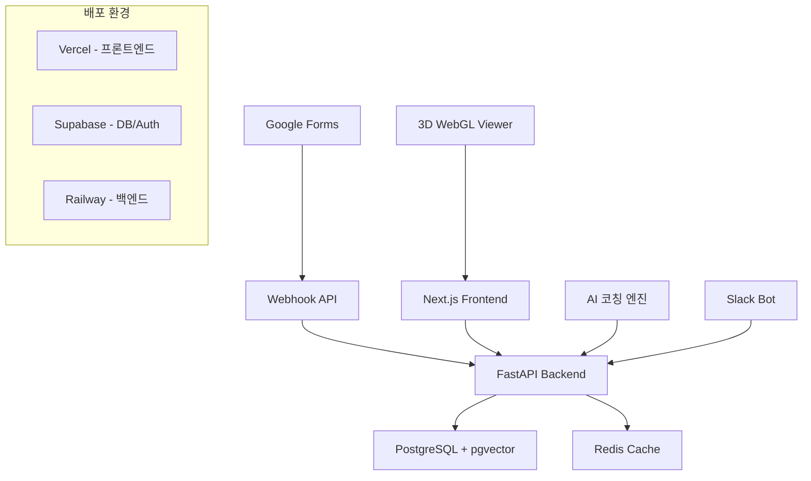
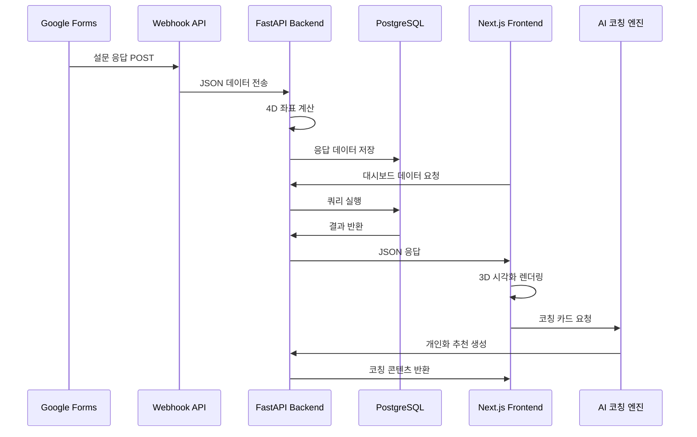
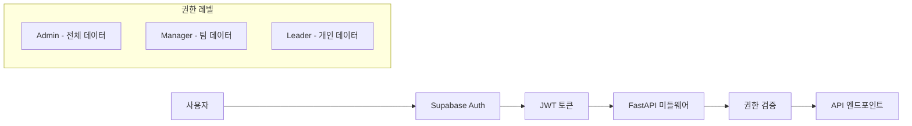

# Grid 3.0 리더십 매핑 플랫폼 시스템 개요

> 최종 업데이트: 2025-08-02  
> 작성자: 헤파이스토스  
> 프로젝트: Grid 3.0 Leadership Mapping Platform

## 1. 시스템 아키텍처 개요

Grid 3.0 리더십 매핑 플랫폼은 **4차원 리더십 지표를 실시간으로 시각화하고 AI 기반 코칭을 제공하는 웹 플랫폼**입니다.

### 핵심 구성 요소



## 2. 아키텍처 패턴

### 2.1 전체 아키텍처: JAMstack + API-First

```
Frontend (JAMstack)     Backend (API-First)     Database
┌─────────────────┐    ┌──────────────────┐    ┌──────────────┐
│ Next.js 14      │    │ FastAPI          │    │ PostgreSQL   │
│ - App Router    │    │ - Async/Await    │    │ - pgvector   │
│ - TypeScript    │    │ - Pydantic v2    │    │ - JSONB      │
│ - Tailwind CSS  │◄───┤ - OpenAPI docs   │◄───┤ - 실시간 구독  │
│ - React Three   │    │ - Background     │    │              │
│   Fiber (3D)    │    │   Tasks          │    │              │
└─────────────────┘    └──────────────────┘    └──────────────┘
        │                        │                       │
        ▼                        ▼                       ▼
   Vercel 배포              Railway 배포              Supabase
```

### 2.2 데이터 플로우



## 3. 핵심 시스템 컴포넌트

### 3.1 프론트엔드 아키텍처

```
app/
├── (dashboard)/           # 대시보드 라우트 그룹
│   ├── page.tsx          # 메인 대시보드
│   ├── leader/[id]/      # 개별 리더 상세
│   └── coaching/         # 코칭 카드 섹션
├── components/
│   ├── ui/               # 기본 UI 컴포넌트
│   ├── charts/           # 차트 컴포넌트
│   │   ├── Grid3D.tsx    # 3D WebGL 그리드
│   │   └── ProgressChart.tsx
│   └── coaching/         # 코칭 관련 컴포넌트
├── lib/
│   ├── api.ts           # API 클라이언트
│   ├── types.ts         # TypeScript 타입
│   └── calculations.ts   # 좌표 계산 로직
└── stores/              # Zustand 상태 관리
    ├── dashboardStore.ts
    └── coachingStore.ts
```

### 3.2 백엔드 아키텍처

```
app/
├── main.py              # FastAPI 앱 엔트리포인트
├── api/
│   ├── routes/
│   │   ├── webhook.py   # Google Forms 웹훅
│   │   ├── leaders.py   # 리더 데이터 API
│   │   ├── coaching.py  # AI 코칭 API
│   │   └── analytics.py # 분석 API
│   └── dependencies.py  # 의존성 주입
├── core/
│   ├── config.py        # 설정 관리
│   ├── database.py      # DB 연결
│   └── security.py      # 인증/보안
├── models/
│   ├── leader.py        # SQLAlchemy 모델
│   ├── response.py
│   └── coaching.py
├── services/
│   ├── calculation.py   # 4D 좌표 계산
│   ├── coaching_engine.py # AI 코칭 로직
│   └── notification.py  # 알림 서비스
└── schemas/
    ├── leader.py        # Pydantic 스키마
    ├── response.py
    └── coaching.py
```

## 4. 데이터 모델링

### 4.1 4차원 리더십 모델

```python
# 핵심 데이터 구조
class Leadership4D:
    people_concern: float      # X축: 사람에 대한 관심 (1-9)
    production_concern: float  # Y축: 성과에 대한 관심 (1-9)
    candor_level: float       # Z축: 진실한 직면 수준 (1-9)
    lmx_quality: float        # Size: 리더-구성원 교환 품질 (1-9)
    
    # 계산된 파생 지표
    leadership_style: str     # "팀형(9,9)", "과업형(1,9)" 등
    coaching_priority: List[str]  # ["경청", "직면", "신뢰구축"]
    risk_score: float         # 번아웃 위험 점수
```

### 4.2 데이터베이스 스키마 개요

```sql
-- 핵심 테이블 구조
CREATE TABLE leaders (
    id UUID PRIMARY KEY,
    name VARCHAR(100) NOT NULL,
    email VARCHAR(255) UNIQUE NOT NULL,
    team VARCHAR(100),
    position VARCHAR(100),
    created_at TIMESTAMP DEFAULT NOW(),
    updated_at TIMESTAMP DEFAULT NOW()
);

CREATE TABLE survey_responses (
    id UUID PRIMARY KEY,
    leader_id UUID REFERENCES leaders(id),
    answers JSONB NOT NULL,
    people_concern FLOAT NOT NULL,
    production_concern FLOAT NOT NULL,
    candor_level FLOAT NOT NULL,
    lmx_quality FLOAT NOT NULL,
    submitted_at TIMESTAMP DEFAULT NOW()
);

CREATE TABLE coaching_sessions (
    id UUID PRIMARY KEY,
    leader_id UUID REFERENCES leaders(id),
    coaching_cards JSONB NOT NULL,
    status VARCHAR(50) DEFAULT 'active',
    created_at TIMESTAMP DEFAULT NOW()
);
```

## 5. 기술적 특징

### 5.1 성능 최적화

1. **프론트엔드 최적화**
   - Next.js App Router의 Server Components 활용
   - React.memo()와 useMemo()로 렌더링 최적화
   - WebGL 렌더링을 위한 Web Workers 활용
   - 이미지 및 폰트 최적화

2. **백엔드 최적화**
   - FastAPI의 비동기 처리로 높은 동시성 지원
   - PostgreSQL 인덱싱 전략
   - Redis 캐싱으로 응답 시간 단축
   - 배경 작업을 위한 Celery 도입 고려

3. **데이터베이스 최적화**
   - pgvector로 벡터 유사도 검색 최적화
   - JSONB 인덱싱으로 빠른 조회
   - 커넥션 풀링 및 읽기 전용 복제본 활용

### 5.2 확장성 설계

1. **수평 확장**
   - 마이크로서비스 아키텍처 준비
   - 로드 밸런서를 통한 트래픽 분산
   - CDN을 통한 정적 자원 배포

2. **수직 확장**
   - 데이터베이스 파티셔닝 전략
   - 캐싱 계층 강화
   - 비동기 작업 큐 도입

## 6. 보안 아키텍처

### 6.1 인증 및 권한



### 6.2 데이터 보호

1. **개인정보 보호**
   - 설문 원문 3년 후 자동 삭제
   - 민감 데이터 암호화 저장
   - GDPR 준수 데이터 처리

2. **API 보안**
   - Rate Limiting으로 DDoS 방지
   - CORS 정책 적용
   - API 키 기반 웹훅 인증

## 7. 모니터링 및 로깅

### 7.1 애플리케이션 모니터링

```python
# 핵심 메트릭
class SystemMetrics:
    response_time: float      # API 응답 시간
    active_users: int         # 동시 접속자
    survey_completion_rate: float  # 설문 완료율
    error_rate: float         # 에러 발생률
    cache_hit_rate: float     # 캐시 적중률
```

### 7.2 비즈니스 메트릭

- 리더 설문 완료율 (목표: ≥95%)
- 4D 이동거리 평균 (목표: +2p↑)
- 팀 OKR 달성률 (목표: +10%↑)
- 리더 번아웃 위험 스코어 (목표: -15%↓)

## 8. 배포 및 운영

### 8.1 CI/CD 파이프라인

```yaml
# GitHub Actions 워크플로우
name: Grid 3.0 Deploy
on:
  push:
    branches: [main]
    
jobs:
  test:
    - 타입스크립트 컴파일
    - Jest 단위 테스트
    - Pytest 백엔드 테스트
    - E2E 테스트 (Playwright)
    
  deploy:
    - Vercel 프론트엔드 배포
    - Railway 백엔드 배포
    - DB 마이그레이션 실행
```

### 8.2 환경 구성

1. **개발 환경**
   - 로컬 PostgreSQL + Redis
   - Hot reload 개발 서버
   - 목 데이터 자동 생성

2. **스테이징 환경**
   - 프로덕션과 동일한 환경
   - 자동 배포 및 테스트
   - 성능 벤치마킹

3. **프로덕션 환경**
   - 고가용성 설정
   - 자동 백업 및 모니터링
   - 블루-그린 배포

## 9. 시스템 제약 사항

### 9.1 기술적 제약

- **동시 사용자**: 200명 (초기 목표)
- **응답 지연**: ≤30초 (설문→그래프 반영)
- **가용성**: 99.5%
- **데이터 보존**: 3년 (개인정보)

### 9.2 비즈니스 제약

- **설문 길이**: 최대 10분 (31문항)
- **코칭 카드**: 3개 추천으로 제한
- **실시간 업데이트**: 30초 간격
- **언어 지원**: 한국어 우선, 영어 추가 예정

## 10. 향후 확장 계획

### 10.1 Phase 2 기능 (Q2)
- Slack Bot 통합 완성
- 다국어 지원 (i18n)
- 모바일 앱 (React Native)
- 고급 분석 대시보드

### 10.2 Phase 3 기능 (Q3)
- AI 코칭 챗봇
- 팀 단위 분석
- 벤치마킹 기능
- API 마켓플레이스

---

이 시스템 개요는 Grid 3.0 리더십 매핑 플랫폼의 전체 아키텍처를 다루며, 개발팀의 기술적 의사결정을 위한 청사진 역할을 합니다.